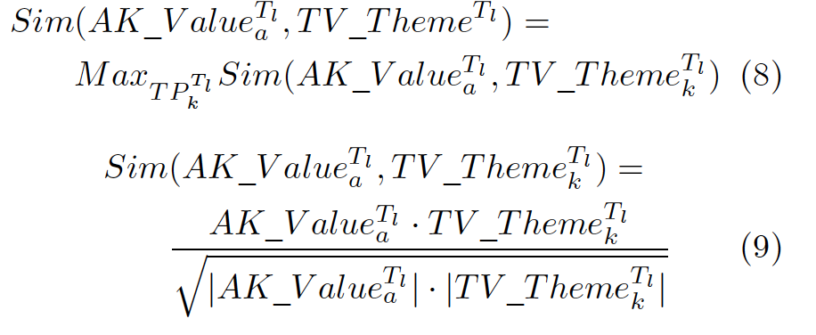

# 举报**中国科学院自动化研究所的王晓副研究员（Email：x.wang@ia.ac.cn）**的**严重的学术不端**的问题。请处理这个害群之马！

这是**中国科学院自动化研究所的王晓副研究员**的**第一作者**身份的两篇文章：

[1] 王晓, 韩双双, 杨林瑶, 曾轲, 王飞跃. 基于ACP的动态网民群体运动组织建模与计算实验研究. 自动化学报, 2020, 46(4): 653−669 doi:  10.16383/j.aas.c190641

[2] X. Wang, X. Zheng, X. Zhang, K. Zeng and F. Wang, "Analysis of Cyber Interactive Behaviors Using Artificial Community and Computational Experiments," in IEEE Transactions on Systems, Man, and Cybernetics: Systems, vol. 47, no. 6, pp. 995-1006, June 2017, doi: 10.1109/TSMC.2016.2615130.

这两篇文章也在其个人主页<http://people.ucas.ac.cn/~0034215> 上写着：

发表论文

……

（5） .基于ACP的动态网民群体运动组织建模与计算实验研究, 自动化学报, 2020, 第 1 作者

……

（10） Analysis of Cyber Interactive Behaviors Using Artificial Community and Computational Experiments, IEEE Transactions on Systems, Man, and Cybernetics: Systems, 2017, 第 1 作者

对于这两篇文章的相似程度，从公式到图表相同雷同之处（附后），让人十分吃惊！文章[2]是王副研究员2016年（她博士在读期间）发表，文章[1]是王副研究员2020年发表。换句话说，英文文章发表在前，中文文章发表在后，并非同期工作。根据《中国科学院对科研不端行为的调查处理暂行办法》，这明显属于**一稿多投和重复发表的行为，这种行为是包括将本质上相同的科研成果改头换面一稿多投或重复发表的行为。**

另外，我也关注到知乎（Zhihu.com）对于此人的评价：（1）来源<https://www.zhihu.com/question/390931751> ， “人渣”、“害人精”；（2）来源 <https://www.zhihu.com/question/359648885> ，“自动化学会选取托举人才的标准是什么？某托举人才只有1篇SCI一作论文，充其量也只是一个合格博士的毕业水平。莫非是’托举人乐于奉献、积极参加国内外学术组织举办的各种活动’？”等等。虽然这与学术不端无关，但是我不禁暗暗思忖：**她是个没有道德的人，所以我必须举报！为国家除害！**

我作为一个初入科研的菜鸟，不禁想问：对于这种一稿多投的行为，中国科学院的处理措施是什么？**让这种人作为副研究员？硕士生导师？**

## **公式雷同列举**

|文章1|文章2|备注|
| :-: | :-: | :-: |
|||完全相同|
|||完全相同|
|||
形式相同

意义相同
|
|||
形式相同

意义相同
|
||

|
形式相同

意义相同
|
|||
形式相同

意义相同
|
|||
形式相同

意义相同
|
|||
形式相同

意义相同
|

在文章[1]中的18个公式中，竟然与10个公式雷同，说明，两篇文章完全是一模一样！这说明文章[1]是由文章[2]洗稿得来的！这是严重的学术不端！

## **图片雷同列举**

|文章1|文章2|备注|
| :-: | :-: | :-: |
|||
示意图

完全相同
|
|||
实验图

完全相同
|
|||
实验图

完全相同
|
|||
实验图

完全相同
|

在文章[1]中的实验部分（4 用户发帖与评论行为的计算实验探讨）中，**所有的**实验结果图一模一样！这说明文章[1]是由文章[2]洗稿得来的！这是严重的学术不端！

## **表格雷同列举**

|文章1|文章2|备注|
| :-: | :-: | :-: |
|||完全相同|
|||完全相同|

在文章[1]中的**所有的**表格一模一样！这说明文章[1]是由文章[2]洗稿得来的！这是严重的学术不端！

